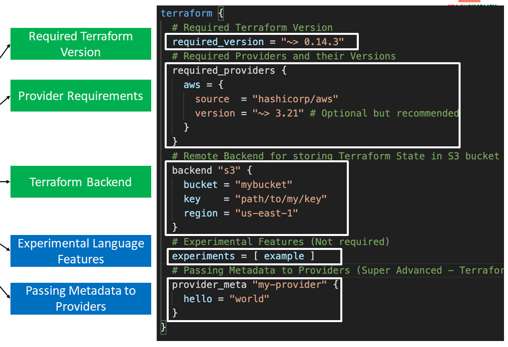
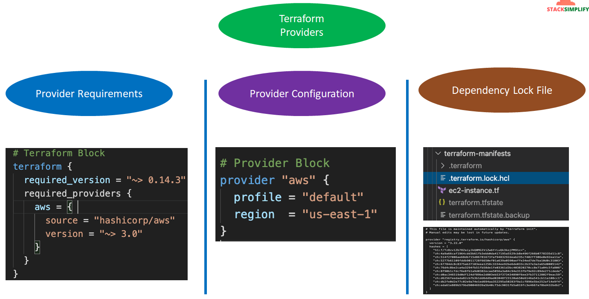
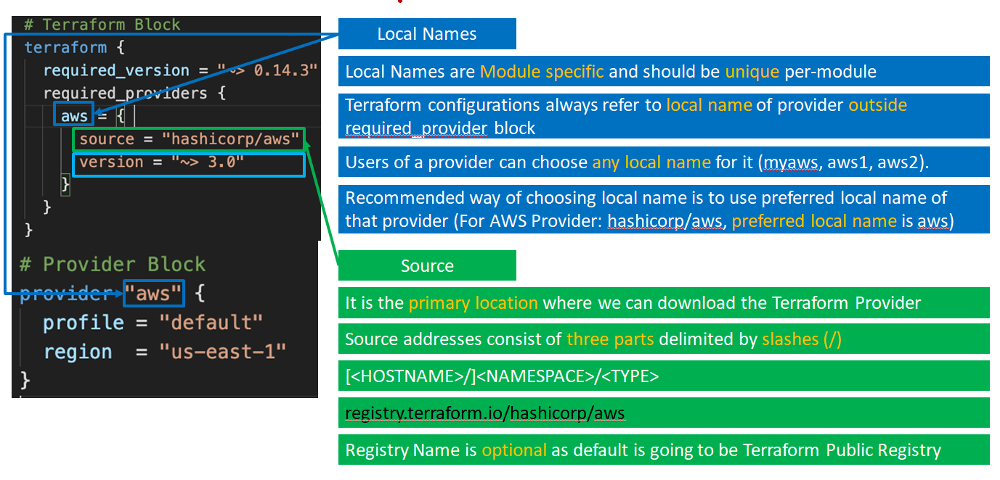

# terraform_eks_50_demo  
Udemy : Terraform on AWS EKS Kubernetes IaC SRE- 50 Real-World Demos  


AWS EKS IAM, Ingress, EBS CSI, EFS CSI, VPC, Fargate, Application & Network Load Balancer, Autoscaling (CA, HPA, VPA)  
Kalyan Reddy Daida  
  
---  
  
GitHub Repository Links  
Course Main Repository: terraform-on-aws-eks  
Course Presentation: Presentation Slides PPT  
Kubernetes Fundamentals GitHub Repository: kubernetes-fundamentals  
Kubernetes Fundamentals Presentation: Presentation Slides  
  
Direct Links  
https://github.com/stacksimplify/terraform-on-aws-eks  
https://github.com/stacksimplify/terraform-on-aws-eks/tree/main/course-presentation  
https://github.com/stacksimplify/kubernetes-fundamentals  
https://github.com/stacksimplify/kubernetes-fundamentals/tree/master/presentation.  
  
---  
  
Dear Students,  
Terraform Basics section will be common for all the three courses listed below  
HashiCopr Certified Terraform Associate - 50 Practical Demos  
Terraform on AWS with SRE & IaC DevOps | Real-World 22 Demos  
Terraform on AWS EKS Kubernetes | Real-World 20 Demos  
  
So you will be seeing the below listed two GitHub repositories in the videos for Terraform Sections and we don't need to worry about them.  
  
https://github.com/stacksimplify/hashicorp-certified-terraform-associate/  
https://github.com/stacksimplify/terraform-on-aws-ec2/  
  
---  

## Top Level Blocks  
- Top Level Blocks
  - Fundamental Blocks
    - Terraform Block
      * <b> Within a terraform block, only constant values can be used </b>
      * Required Terraform Version
      * List Required Providers
      * Terraform Backend  
      *
        ```
        terraform {
          required_version = "~> 0.14"
          required_providers {
            aws = {
              source  = "hashicorp/aws"
              version = "~> 3.0"
            }
          }
          # Adding Backend as S3 for Remote State Storage with State Locking
          backend "s3" {
            bucket = "terraform-stacksimplify"
            key    = "dev2/terraform.tfstate"
            region = "us-east-1"  
        
            # For State Locking
            dynamodb_table = "terraform-dev-state-table"
          }
        }
        ```
      * 
    - Provider  Block
      * Terraform relies on providers to interact with Remote Systems
      * Declare providers for Terraform to install providers & use them
      * Provider configurations belong to Root Module
    - Resources Block
      * Each Resource Block describes one or more Infrastructure Objects
      * Resource Behavior: How Terraform handles resource declarations?
      * Provisioners: We can configure Resource post-creation actions
  - Variable Blocks
    - Input Variable Block
    - Output Value Block
    - Local Values Block
  - Calling/Referanceing Blocks
    - Data Sources Block
    - Modules Block

---

Nice Samples : https://github.com/stacksimplify/terraform-on-aws-ec2/blob/main/02-Terraform-Basics/02-03-Terraform-Language-Syntax/terraform-manifests/top-level-blocks-samples.tf

---

## Provider
* 
* 

